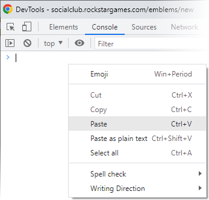

# Emblem Editor Expanded & Enhanced

#### Installation as Tampermonkey user-script:

I recommend this installation method because once it's installed you won't need to deal with code anymore.

- Install the Tampermonkey extension from the Chrome Web Store.

- Create a new Tampermonkey script and paste the source from
[emblem-editor-expanded-enhanced.js](emblem-editor-expanded-enhanced.js) into it, then Save.

- Navigate to an existing emblem or a new emblem in Social Club.

#### Run with no installation:

- Alternatively, navigate to an existing emblem or a new emblem in Social Club.

- Copy the code in [emblem-editor-expanded-enhanced.js](emblem-editor-expanded-enhanced.js)

- Press F12 to open the Javascript console, paste the code and press Enter to execute it.
