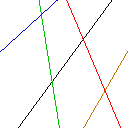
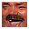

# The Digitizer

Emblem Editor Expanded & Enhanced

------------------------------------------------------------------------------------------------------------------------

The digitizer converts a 16x16, 32x32, 64x64 or 128x128 PNG into "pixels" in the Emblem Editor.
The digitizer always adds layers on top of the existing image. Transparent pixels are discared.

128x128 images give the best quality, but they also use a lot of layers. Therefore, use 128x128 for lines, contours,
text, etc., and lower resolutions to fill large areas of the canvas.

Check out the [Import examples](../readme-import/readme.md) for more complex examples.

Download these images and try to use them with the Digitizer.

------------------------------------------------------------------------------------------------------------------------

| Size    | Layer Count | Image              | Result                 | Description                   |
|---------|-------------|--------------------|------------------------|-------------------------------|
| 32x32   | 136 / ~830  |  | N/A                    | Hello World text "pixelated". |
| 128x128 | 724 / ~830  |  | N/A                    | Hello World antialiased.      |
| 128x128 | 516 / ~830  |  | N/A                    | Random lines.                 |
| 32x32   | 784 / ~830  |  | [Result](result-4.jpg) | Low-resolution "kekw" emoji.  |
