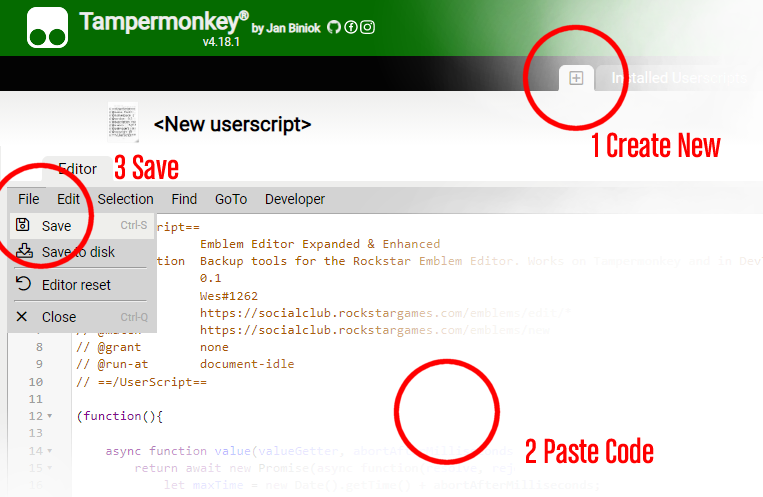
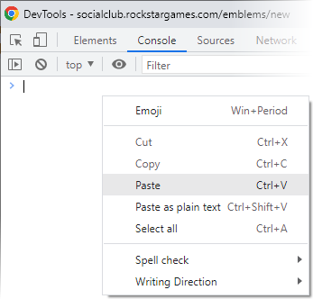
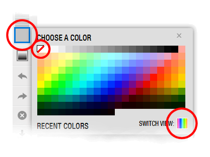

[raw-code]: https://raw.githubusercontent.com/Wes0617/EmblemEditorEE/main/emblem-editor-expanded-enhanced.js

# Emblem Editor Expanded & Enhanced

Adds batch and backup functionality to the Emblem Editor.

------------------------------------------------------------------------------------------------------------------------

Check out some [Digitizer Examples](readme-digitizer.md) and [Import Examples](readme-import.md).
But first, make sure to read the installation guide below!

------------------------------------------------------------------------------------------------------------------------

**This code is open source.** You can verify yourself what it does, or you can ask a friend to do that.
Never run code you don't know. Never run obfuscated code. Only run code from people or organizations you
trust, or open source, verified code. I.e. categorically don't trust the "emblem creation services" that provide you
with random hidden code to run in your console. They super dodgy. Just NO. Also this is friendly to the Emblem Editor,
it doesn't "hack" into it, it just "uses" it… at superhuman speed.

------------------------------------------------------------------------------------------------------------------------

### Run as Tampermonkey user-script:

I recommend this installation method because once it's installed you won't need to deal with code anymore.
I haven't tested with Greasemonkey (i.e. the Firefox equivalent of Tampermonkey). It should work though.

- Install the Tampermonkey extension from the Chrome Web Store.

- Copy the code in [emblem-editor-expanded-enhanced.js][raw-code] in the clipboard.

- Create a new Tampermonkey script and paste the code into it, then Save.

- Navigate to an existing emblem or a new emblem in Social Club.

------------------------------------------------------------------------------------------------------------------------

### Otherwise, run with no installation:

This solution uses no third-party software.

- Navigate to an existing emblem or a new emblem in Social Club.

- Copy the code in [emblem-editor-expanded-enhanced.js][raw-code] in the clipboard.

- Press F12 to open the Javascript console, paste the code and press Enter to execute it.

- Press F12 again to close the Javascript console.

------------------------------------------------------------------------------------------------------------------------

### Remember to make the background transparent>

By default the canvas has a white background, but it actually supports transparent pixels.
I putting this here because I feel this will be a common issue
for people that have never used the emblem editor before.
So, here's how: select the red diagonal line from the background color picker.

